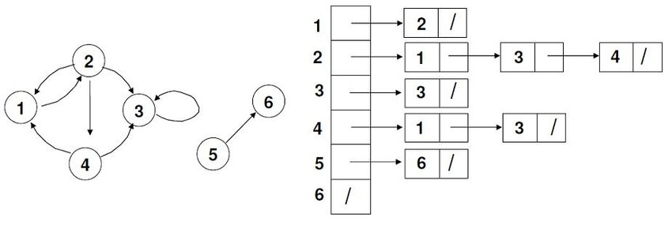
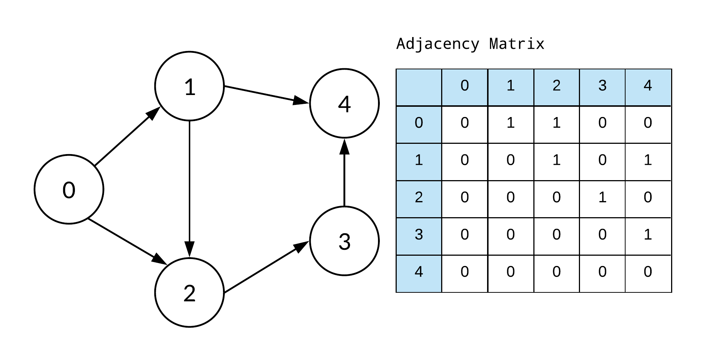

# Matrix NEAT

[](https://gitlab.com/my_neat/matrix-neat/-/commits/master)
[](https://gitlab.com/my_neat/matrix-neat)
[](https://discord.gg/P4FJG8rEYC)

Feel free to join our community on [Discord](https://discord.gg/P4FJG8rEYC).

## How we represent a graph

There are 2 main ways how to represent a graph programmatically.

### Adjacency lists

<br>
Most of the NEAT libraries use adjacency lists. Every node can be expressed as an object with references to incoming and
outgoing connections.

This concept makes debugging very challenging as we experienced with [carrot](https://github.com/liquidcarrot/carrot).

### Adjacency matrices

<br>
This library uses matrices to express the network graph. in the matrix each row is a node and each column is also a
node.

The row gives the input node and the column the output node of a connection.

So for example
```[row: 1, column: 3] = 0.3```
means there is a connection between node 1 and 3 with a weight of 0.3

### Comparison

All values for worst case scenario.

V = Number of nodes<br>
E = Number of connections

Criterion | Lists | Matrices
------ | ------ | ------
**Storage**   | O(V + E)   | O(V x V)
**Add node**   | O(1)   | O(V)
**Add connection**   | O(1)   | O(1)
**Remove connection**   | O(E)   | O(1)
**Querying**   | O(V)   | O(1)

Because the query of the values is used most frequently, this is exactly the point where optimization should take place.
Therefore, adjacency matrices are faster than adjacency lists for this particular case.